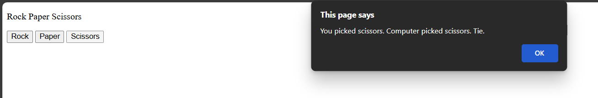

# 🪨📄✂️ Rock Paper Scissors (Stage 1 – Basic)

This is the first stage of my Rock Paper Scissors project.  
A very simple version built with **HTML & JavaScript**, where the game result is displayed using **alert boxes**.  

👉 This marks the starting point of my learning journey before moving to advanced versions like score tracking and autoplay.  

---

## ✨ Features
- 🎮 **Play Mode** – Choose Rock, Paper, or Scissors.  
- 🎲 **Random Computer Move** – Generated using `Math.random()`.  
- ⚡ **Alert Output** – Results are shown in a popup alert.  
- 🧩 Simple and minimal – just one HTML file.  

---

## 📸 Screenshot Preview
Here’s how the basic version looks:  

  

---

## 🚀 Demo
Play it live here 👉 [Rock Paper Scissors – Stage 1](https://harikareddi13.github.io/RockPaperScissors-basic/)  

---

## 🛠️ Tools & Technologies Used
- **HTML5** → For structuring the page.  
- **JavaScript (Vanilla JS)** → For game logic:
  - Generating computer moves with `Math.random()`.  
  - Handling button clicks via `onclick`.  
  - Using conditionals to decide win/lose/tie.  
  - Displaying results with `alert()`.  

---

## 📚 Things I Learned
- Basics of **event handling** (`onclick` in HTML).  
- Using **Math.random()** to simulate randomness.  
- Writing **if-else conditions** for game logic.  
- Displaying output with **alert boxes**.  

---

## ⚡ How to Access / Run

🎮 **Play Online**: [Rock Paper Scissors – Stage 1]https://harikareddi13.github.io/RockPaperScissors-basic/)  

💻 **Run Locally**:  
1. Clone this repository:
   ```bash
   git clone https://github.com/HarikaReddi13/RockPaperScissor_Stage1.git
